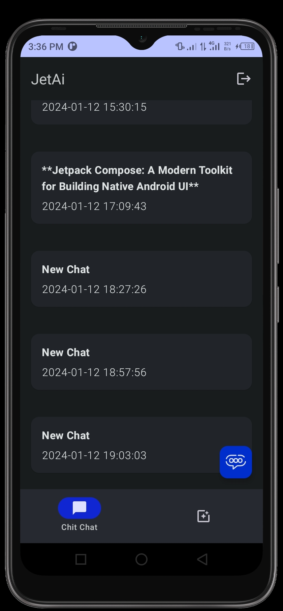
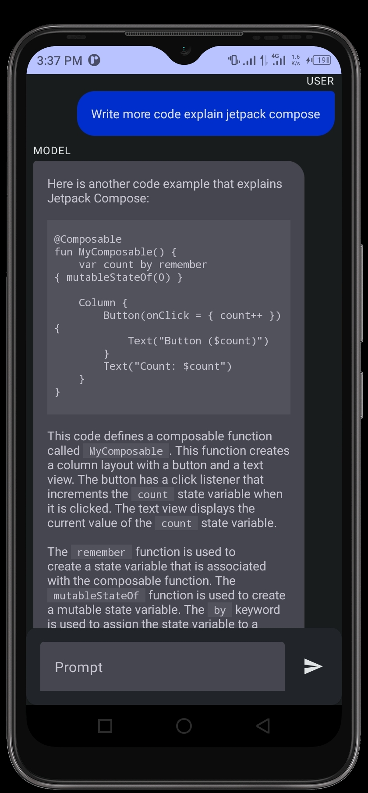
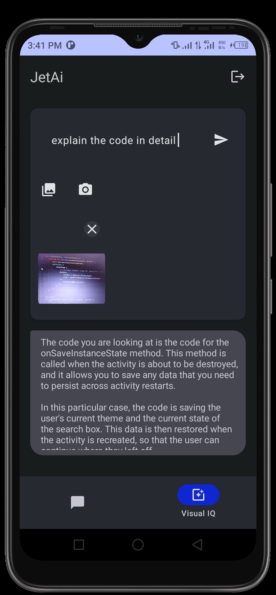

# JetAI App with Generative AI Integration

This repository contains screenshots of an app called JetAI, which integrates Generative AI using Jetpack Compose, Gemini, and Firebase technologies.

## Screenshots

1.  - SignUp Screen
   
2.  - Login Screen
   
3.  - Chatroom Screen
   
4.  - Message Screen
   
5.  - Photo Reasoning Screen

## Description

JetAI is an application designed to showcase the power of Generative AI in mobile applications. It utilizes Jetpack Compose for modern UI development, Gemini for integrating Generative AI models, and Firebase for backend services.

## Features

- **Generative AI Integration**: JetAI integrates Generative AI models to perform various tasks such as image generation, text generation, etc.
  
- **Jetpack Compose UI**: The application employs Jetpack Compose for building dynamic and responsive user interfaces.
  
- **Firebase Integration**: Firebase services are utilized for backend functionalities such as authentication, data storage, and more.

## Usage

To use the JetAI app, follow these steps:

1. Clone the repository to your local machine.
   
2. Open the project in Android Studio or any compatible IDE.
   
3. Build and run the project on an Android device or emulator.

## Contributing

Contributions are welcome! If you'd like to contribute to the JetAI app, feel free to fork the repository and submit a pull request with your changes.

## License

This project is licensed under the [MIT License](LICENSE). Feel free to use, modify, and distribute the code as per the terms of the license.

